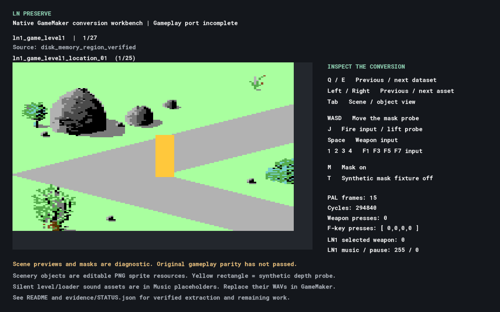

# LNPreserve

One editable GameMaker project for a native preservation conversion of **The Last Ninja**, **Last Ninja 2** and **Last Ninja 3**.

**This is an incomplete conversion workbench, not a playable trilogy. Full gameplay cycle accuracy has not been established.** The supplied C64 disk programs are the source material. No C64 emulator is embedded in the GameMaker runtime.

Open **[LNPreserve/LNPreserve.yyp](LNPreserve/LNPreserve.yyp)** in GameMaker. It builds and runs with the installed **LTS 2026 runtime 2026.0.0.23**. Converted graphics, native GML, shaders, verification data and silent sound assets are already included; opening the project does not require extraction tools.



## What is present

| Material | Current result |
| --- | --- |
| Supplied ZIPs | Eight D64 images inventoried, hashed and extracted without changing their contents |
| Scenery | 1,597 editable PNG object resources across 26 datasets |
| Scene assembly | 436 diagnostic previews and mask images; this is **not** a count of validated game rooms |
| LN1 character graphics | 192 PNG sprite parts, checked against the original 6502 decompressor |
| Native original logic | LN1 sprite decompression and the F-key/Space selection routine |
| Input | WASD, 1–4, Space and a separate joystick-fire binding |
| Depth | Foot-position depth helper and an alpha-mask shader with real GPU pixel tests |
| Audio | 41 named, silent GameMaker sound assets for level, loader and additional cues |

All six LN1 scenery datasets match the supplied disk payloads or a captured original memory region. LN2/LN3 scenery currently comes from Integrator 2012 reference datasets and has **not** been matched to the supplied disk versions. Individual object decoding does not prove that scene assembly, overlapping colours or occlusion matches the games.

The yellow rectangle is a synthetic mask probe. Its movement and lift are demonstrations, not reconstructed Armakuni movement. Character parts are available in **Graphics → ln1_character_parts**; their animation sequencing is not yet implemented.

## Controls

| Key | Mapping |
| --- | --- |
| W / A / S / D | Original joystick up / left / down / right; moves the diagnostic probe |
| 1 / 2 / 3 / 4 | Original F1 / F3 / F5 / F7 |
| Space | Weapon selection |
| J | Separate joystick fire; temporarily lifts the diagnostic probe |
| Q / E | Previous / next asset dataset |
| Left / Right | Previous / next image |
| Tab | Scene / individual-object view |
| M | Enable / disable masking |
| T | Show the synthetic mask fixture |

The verified LN1 selection routine maps F1 to music toggle, F3/F5 to next/previous available inventory entry, F7 to pause state, and Space to the next available weapon. Those state changes are exposed in the workbench. Display requests are recorded; the original dashboard and gameplay pause behaviour are not yet connected. LN2/LN3 must be decoded separately before assuming identical behaviour.

## Editing assets and replacing music

Edit the imported sprites directly in GameMaker's image editor. Their PNG layers are in `LNPreserve/sprites/`. Source record IDs and addresses are retained in the JSON manifests under `LNPreserve/datafiles/`.

Sound names use `snd_ln<game>_<level>_game` and `snd_ln<game>_<level>_loader`. Replace their silent WAVs using GameMaker's sound editor. The music manifest records known SID subtune mappings; unknown loader mappings remain `null`. Do not interpret the silent duration as an original song length. Sound effects have not been recovered.

`tools/build_project.py` preserves existing sprite resources and replacement sound files. **Only use `--refresh-graphics` when intentionally replacing edited graphics from extracted PNGs.** `tools/decode_graphics.py` overwrites diagnostic source PNGs under `datafiles/graphics/`, not the editable sprite layers.

## Verification

See **[evidence/STATUS.json](evidence/STATUS.json)** for the machine-readable status and **[docs/ACCURACY.md](docs/ACCURACY.md)** for the limits of each check.

- Actual compiled GML passes clock, input and depth checks.
- GPU readback verifies partial foreground coverage and a transparent hole.
- All 192 native sprite decodes match the original 6502 output and instruction-cycle counts.
- All 1,024 previous/current combinations of the five selection keys match original selection state and the order of external display/SID requests. Display callees are intercepted in that test; their behaviour and timing are not covered.
- Full gameplay, animation and C64 bus timing have **not** passed parity tests.

## Build and reproduce

The IDE can run the project directly. For a command-line build on Windows:

```powershell
./tools/compile.ps1 -RuntimePath 'C:/ProgramData/GameMakerStudio2-LTS2026/Cache/runtimes/runtime-2026.0.0.23'
python tools/run_checks.py --runner 'C:/ProgramData/GameMakerStudio2-LTS2026/Cache/runtimes/runtime-2026.0.0.23/windows/x64/Runner.exe'
```

Build output goes to ignored `build/`. The runner test exits after five rendered host frames, writes verification JSON under `evidence/`, and saves screenshots there.

For extraction and structural checks, use Python 3 with Pillow and py65 (`pip install -r tools/requirements.txt`). The original ZIPs, reference tools and RAM captures stay local in ignored directories. See **[docs/REPRODUCING.md](docs/REPRODUCING.md)** for the extraction sequence and **[docs/SOURCES.md](docs/SOURCES.md)** for provenance.

## Remaining conversion work

Movement, collision, jumping, animation scheduling, enemies, combat, puzzles, item use, room transitions, death and completion still need native translations. LN2/LN3 binaries still need unpacking and character recovery. Original scene blending and masking need comparison with captures. Final acceptance requires deterministic input replays across all games and levels, compared at defined original cycle boundaries.
