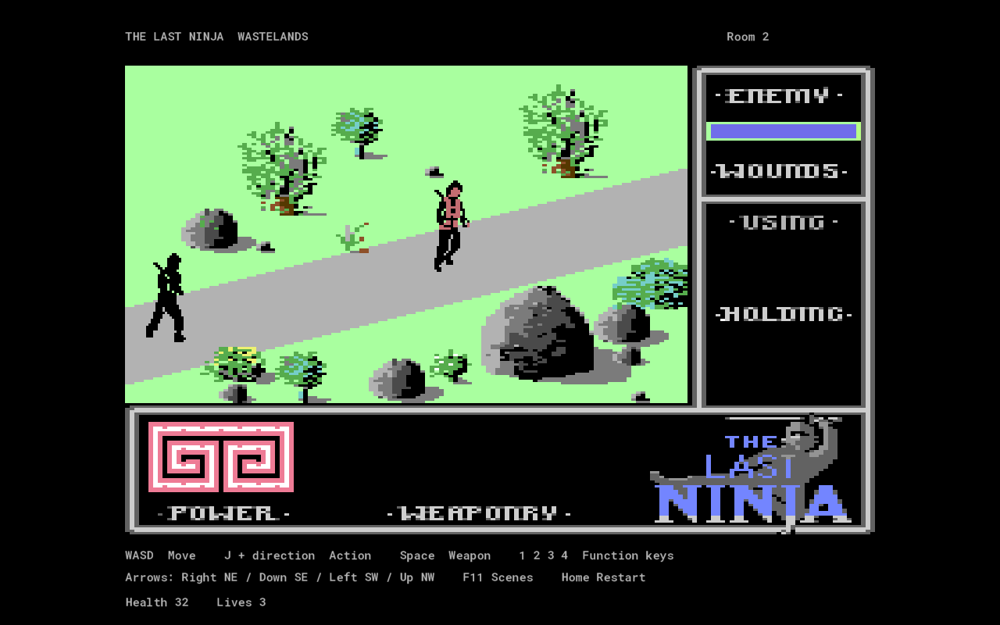

# LNPreserve

One editable GameMaker project for The Last Ninja, Last Ninja 2 and Last Ninja 3.

The single shared project is [RobertRamsay/LNPreserve](https://github.com/RobertRamsay/LNPreserve), on `main`. Future updates go into this repository and the same `LNPreserve/LNPreserve.yyp`; separately named project downloads are not the current development copy.

**Current build: native prototypes in all 18 levels across the three games, with 291 selectable scenes. Complete objectives, encounters and endings are still in progress; the complete trilogy and 1:1 system timing have not passed verification.**

Open [LNPreserve/LNPreserve.yyp](LNPreserve/LNPreserve.yyp) in GameMaker LTS 2026 and run it. The project now starts in the game view. No C64 emulator runs inside GameMaker.

## Gameplay in this build

- Original assembled player and enemy poses, including walking, jumping and fighting sequences.
- Native player movement, fractional coordinates, room boundaries, enemy decisions and melee hit ranges.
- All six LN1 levels, with 134 rooms, original collision boundaries, entrances and enemy placements. Ordinary level exits load the next level and carry inventory and lives.
- Twenty-three original item/mechanism placements across LN1, pickup checks and weapon selection. Uncollected items flash twice on scene entry using the original colour ramp, including nunchakus.
- Original throwing-star and smoke projectile graphics, ammunition and movement tables; level-specific actors include skeletons and the final enemy.
- Native handlers for climbing, secret passages, item protection, statue interaction and the final scroll sequence. These still need complete original-game playthrough comparison.
- The original FOUND label and item icon appear for 150 game ticks after a pickup, then return to USING. Inventory selection updates HOLDING.
- Enemy wounds update the original bar and survive scene changes. Defeated guards remain defeated for the current run.
- Approach either Wastelands Buddha empty handed, facing northwest, to kneel and see the original missing-item hint. S + D finishes prayer with the original stand-up animation.
- River deaths use the original player graphics sinking behind a waterline mask, and respawn without resuming a death frame. The invented ripple has been removed.
- Per-pixel scenery masks that activate at the original room-specific depth thresholds.

This is **not a verified complete first game**. The level-specific puzzle, special-enemy, projectile-combat and ending handlers need further original-game comparison. Some palette effects, death presentation and dashboard rendering remain incomplete. The dashboard combines a captured original frame with live original status labels, icons and enemy wounds; player power/lives still use temporary text. Original recoverable enemy knockouts still need distinguishing from permanent deaths. Enemy random sampling reproduces the original algorithm but its hardware-read phase is not verified.

LN2 now supports native testing in Central Park, Street, Sewers, Basement, Office, Mansion and Final Battle: 92 selectable scenes, original entrances and collision boundaries, assembled player/enemy animation, melee and per-scene wounds. Its source item records, partial interaction handlers, inventory scene variants, automatic entrance motion, moving scenery actors and Mansion helicopter attachment/drop are connected. The original room/actor packages were recovered from all seven supplied-game loader captures; identical images and normal actor banks share resources.

LN2 is also **incomplete**: boundary hazard sequences, projectile behavior, final objectives/boss, several object interactions, item flashes, original dashboard, palette changes and complete death/ending presentation still require work. Its HUD currently uses temporary text, and its isolated original-routine comparisons do not establish complete combat or playthrough parity.

LN3 now has five native level prototypes and 65 selectable scenes. Original player/enemy animation, movement, collision, ordinary melee/projectiles, room entrances, climbing and falling responses, health persistence and fragment masking are connected. Its 1,158 unique editable sprite-part frames share one sprite resource; 66 scenery records are preserved. Fire scene 12 is an isolated partial scenery record with no ordinary entrance, exit or enemy, so it is excluded from gameplay selection. Void’s final encounter uses its original special entrance and can be selected for testing.

LN3 remains **incomplete**: item pickup/use and objectives, animated scenery, special encounter progression (including the reflected-bolt gateway to the final encounter), the final ending, original dashboard, several palette effects and whole-system update timing still require work. The HUD uses temporary text. Level progression is connected to the recovered ordinary guardian defeat request; complete guardian encounters have not passed original replays.

## Controls

| Key | Action |
| --- | --- |
| WASD | Original joystick directions, including diagonals |
| J | Original fire button; combine with directions for actions |
| Space | Cycle available weapons |
| 1 | Music toggle |
| 2 / 3 | Next / previous available inventory item |
| 4 | Pause |
| Home | Restart this prototype |
| Right / Down / Left / Up arrows | Test exits: NE / SE / SW / NW |
| F11 | Choose a game, level and scene |
| F12 | Optional conversion workbench |

Music assets are still named silent placeholders. Replace the corresponding WAV in GameMaker to supply music. Sound effects are not recovered.

The arrow shortcuts follow the three games’ recovered ordinary room links and use each destination's original entrance position and facing, including the one-way Dungeons entrance. When two exits face the same direction, the nearer exit is used. One press performs one jump. Missing directions leave the current room unchanged. Inventory, living-player health and saved enemy wounds survive; LN1 entry flashes restart. Test jumps cancel an unfinished action, prayer or death, and restore a dead player so testing can continue. Original entrance-specific sequences still run. These are development controls, not original gameplay behavior.

F11’s scene picker exposes native prototypes in all 18 levels: six LN1, seven LN2 and five LN3. The original special entrance makes Void’s final encounter selectable even though it has no ordinary room link. LN3’s remaining object work is labelled in the picker. Gameplay pauses while the picker, a preview or the workbench is open. The alternate Mansion room-10 drawing shares that room's state and is not offered as a separate entrance.

## Verification

Actual compiled GML passes comparisons against offline execution of original machine code:

- 2,856 player updates: movement, boundary collision, action state and requested pose, including 128 kneeling/standing samples.
- 7,680 enemy updates: decisions and animation with the same supplied random-byte returns.
- 6,843 melee hit tests: directional ranges and defensive states.
- 1,024 selection-key transitions and 192 sprite decompressions.
- 1,536 river sinking timer states, including timer wrap and immediate first descent.
- 54 original exit-routine cases for test navigation, including original spawn position/facing; all 25 Wastelands rooms are reachable through directional shortcuts.
- 249 further original exit-routine cases for LN1 levels 2–6, plus native traversal proving all 134 rooms can be reached through arrow shortcuts.
- 4,480 original enemy-action selections in the later levels, including skeleton and boss selectors; 10,900 integration ticks across their 109 rooms.
- 4,032 original one-tick projectile movement/lifetime cases across all six LN1 level banks.
- LN2: 34,664 player updates, 50,432 enemy updates and 21,000 melee range comparisons across all seven original banks.
- LN2: 784 entrance state comparisons, 11,136 automatic entrance-motion states/poses, 3,520 moving-world state comparisons and 256 Mansion helicopter attachment/drop states/poses. Display calls are intercepted; the helicopter check excludes world-event dispatch.
- LN2: 191 original ordinary exits and 9,200 integration ticks across 92 selectable native scenes, plus per-scene health persistence.
- LN3: 6,000 movement states, 5,490 action states, 3,510 input states and 10,925 animation updates across all five original banks. Animation comparisons intercept the bitmap compositor.
- LN3: 4,224 original sprite visibility masks across all 66 recovered scenes, including edge-fragment carryover. GPU application additionally passes 66,528 alpha/tint pixel checks against 132 original decompressed and masked ordinary sprite parts. Expanded and multicolour special actors still need full original-output comparisons.
- LN3: 7,191 collision responses, 6,000 enemy decision/attack/patrol/recovery states, 6,000 melee/projectile states, and 3,064 room-entry/climbing/falling states.
- LN3: 201 destination records and 6,500 integration ticks across 65 selectable scenes, with all scenes rendered in the compiled runner. These integration ticks are regression coverage, not original-playthrough comparisons.

A further 660-update integration check crosses the first original exit and runs an enemy encounter. Feedback regressions check pickup expiry across clock wrap, scene-entry flash state, enemy damage/death persistence, armed/unarmed prayer, sinking and stale death frames after respawn. GPU tests check scenery masking, transparent holes and the waterline cutoff. These checks **do not certify full gameplay, complete combat dispatch, sprite composition, hardware random timing or cycle accuracy**. See [evidence/STATUS.json](evidence/STATUS.json) and [docs/ACCURACY.md](docs/ACCURACY.md).

## Assets and rebuilding

The earlier scenery resources and workbench remain available. All six LN1 scenery datasets match supplied disk payloads or captured original memory. LN2's new gameplay scenery is rendered offline by the supplied game's recovered drawing code; its older workbench previews retain their earlier provenance. All five LN3 scenery payloads now match the supplied-game loader captures; this does not change the older preview images beyond the previously approved opening-scene fix. Edit sprites and native GML directly in GameMaker.

LN3 level 1's opening scene now matches all 34,560 background pixels of the supplied C64 game, using the project's chosen palette. Its 1,392 corrected pixels include the grey rock faces and overlapping scenery edges. Only this scene was updated; the wider colour corrections remain unapplied, as requested. The complete level-1 scenery payload also matches the supplied game's loaded memory. See [the colour comparison](evidence/scenery_colour_comparison.png) and [audit scope](evidence/scenery_colour_audit.json); the comparison includes proposed changes to other scenes that are not in the project.

The scenery cleanup restores the final pieces of LN2 loader pictures and the mirrored pieces missing from LN3 scenes. The 2,033 scenery image records now share 1,702 unique PNGs; source IDs remain in the manifest and catalog. In total, 345 duplicate sprite resources and 436 empty preview masks were removed. GameMaker's required frame/layer files and native gameplay masks are preserved. See the [before/after images](evidence/asset_cleanup_comparison.png) and [cleanup evidence](evidence/asset_cleanup.json).

The supplied LN1 Wastelands river was inspected through full submersion in VICE. That routine keeps the original player pose and clears sprite rows at the waterline; no separate ripple was observed. The [reference strip](evidence/ln1_original_river.png) and [checkpoint record](evidence/ln1_river_reference.json) use an injected room/position fixture, not a whole-game input replay.

This was also checked through walking and a failed jump from the river entrance, followed by complete sinking. Both retained the original pose during masking. The three white flapping frames are used by birds in the Buddha scenes. [River-entry captures](evidence/ln1_river_entry_comparison.png) document the check; no new LN1 splash artwork was added.

Build with `tools/compile.ps1`; run native checks with `tools/run_checks.py --runner <installed GameMaker Runner.exe>`. `tools/validate_project.py` checks source identities and project resources. Native code is under `LNPreserve/scripts/ln1_*`, `ln2_*` and `ln3_*`; decoded gameplay tables are under `LNPreserve/datafiles/play/ln1`, `ln2` and `ln3`.

Extraction tools use original RAM only offline. They do not become part of the game runtime. `export_ln1_world.py` and `export_ln1_play.py` preserve existing sprite edits unless explicitly invoked with `--refresh`. Original disks, emulator tools and captures remain local under ignored directories.

`capture_ln1_levels.py`, `ln1_level_source.py` and `export_ln1_levels.py` recover the later LN1 level packages. Identical new assets share existing sprite resources; 83 duplicate resources are avoided. The fountain animation also uses the original sprite's scrolling rows. `capture_ln2_levels.py`, `export_ln2_content.py` and `export_ln2_assets.py` recover LN2's seven original room/actor packages. The LN2 tools recover conditional animation entries by exercising the original entrance hooks as well as decoding direct references.
